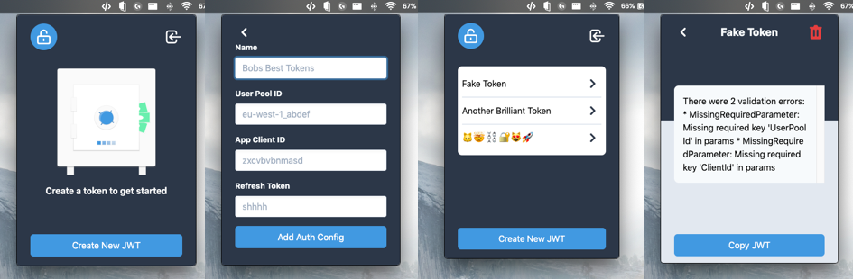

# unlock

Get a fresh jwt using your refresh token from cognito for rapid development of your apis.

*WARNING*: This is alpha software. It might not work so great yet. I also don't know if this is a terrible idea. With your feedback it will get better. This meets my needs but if it could help you with some small ajustments let me know :smile:

## Features

* Uses Cognito REFRESH_TOKEN_AUTH to get a new JWT.

## Development

This application is build with electron, the tooling will be familiar if you have worked on a front end project using React.

An electron app is made up of two processes. The render process and the node process. The node process can be found in the [backend folder](./src/backend/main.js), and the render process in the [app folder](./src/app/render.js). The node process handles any OS interaction, like creating the window, storing the data, calling the aws-sdk and copying to the clipboard. The render process is a chromium instance its basically a single page app.

The node process has a react inspired reducer that calculates the new state when invoked with an change using electrons ipc. The new state is sent in the response and the app renders the update.

The app uses [lit-html](https://lit-html.polymer-project.org/) for its templating. This makes it easy to write all the frontend code in javascript. It might feel a bit like react. But with less clear documentation. Its styled with the always amazing [tailwindcss](https://tailwindcss.com/). The large icon is [undraw](https://undraw.co/) and the smaller app icons are [Hero Icons](https://github.com/refactoringui/heroicons).
